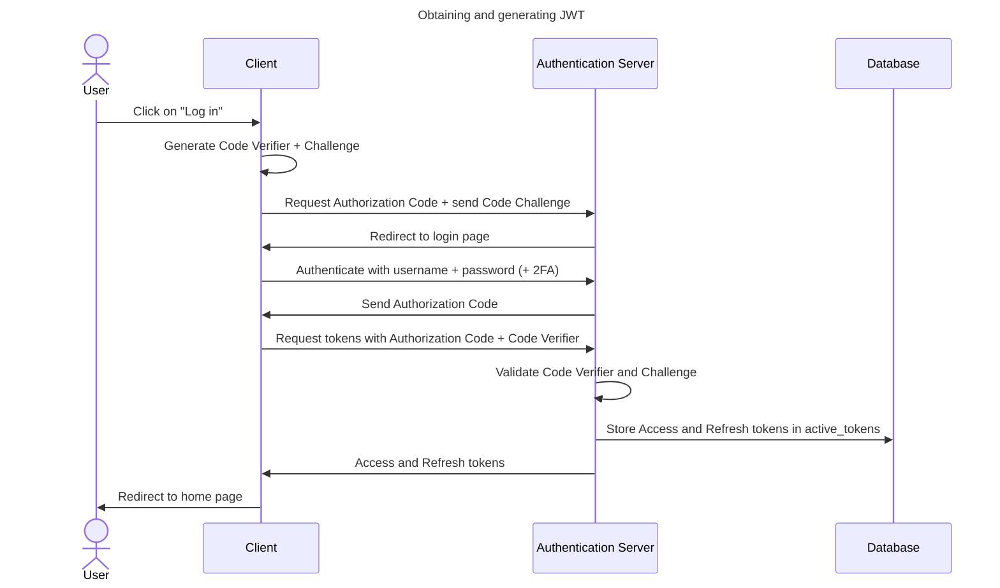
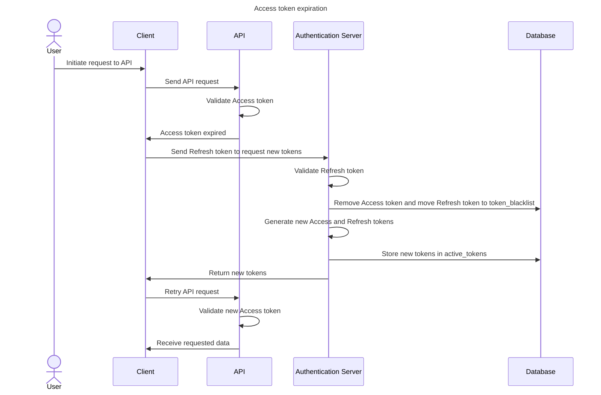

# JWT

This document outlines how this Authentication server generates and manages Json Web Tokens (JWTs) and how the keys to sign them are managed.

---

## Key management

In order to have a secure authentication process we need to have a secure process of managing the keys to sign the JWTs. This document will try to describe this process.

### Initialization

Upon initialization of the server a KeyStore is initialized. This keystore will look up the private and public keys which are used to sign and verify JWTs. If those do not exist yet (when the server initialized for the first time on a system), it'll generate new ones.

The server will generate a public and private key-pair for each audience. This is to make sure that JWTs can't be used between different audiences.

The public key will be made available as static assets so that consumers of the JWTs can validate JWTs on integrity. They will be made available under the following path: `/<kid>.key`.

The public and private keys will be stored in the database to make it easier to add metadata. They'll be stored in the following format:

| Column     | Type                      | Description                                               |
|------------|---------------------------|-----------------------------------------------------------|
| kid        | String                    | The ID of the key.                                        |
| key        | String                    | The actual key itself in PEM format.                      |
| private    | Boolean                   | Whether the key is the private or public key.             |
| type       | Enum('refresh', 'access') | Whether the key is used to sign refresh or access tokens. |
| audience   | String                    | Whom the intended recipient is of the signed tokens.      |
| created_at | Date                      | When the key was created.                                 |
| expires_at | Date                      | When the key should be expired.                           |

Based on the `created_at` column, the current public and private keys are determined. When a key-pair has expired, the private key will be removed instantly, making the server unable to sign more keys.

### Token generation

Every time a new JWT is generated and signed, the `expires-at` column of the public key that is associated with the private key used to sign the JWT, will be updated to match the expiration date of the JWT. This would allow for a grace period for when the private key has expired. Only after the last JWT, that was signed with the expired private key, will expire will the associated public key be removed as well.

---

## Access and refresh tokens

This server uses Access and Refresh JWTs in order to authenticate and authorize Users. Whenever a User logs successfully logs in, an access and refresh JWT is generated for them and returned in Cookies. These Cookies are signed, secured, and set to `httpOnly`. The cookies are aptly named `access-token` and `refresh-token` and are also restricted to the domain. The expiration of the cookies will match that of the provided JWT.

Access tokens will have an expiration time of `10 minutes`, while a refresh token will have an expiration time of `7 days`.

However, when an access token expires and the refresh token is used to generate a new access token, the refresh token is also revoked and a new refresh token is also provided, ensuring that the refresh token is rotated as well. Furthermore, whenever a User logs out the existing tokens will be revoked as well.

A token is blacklisted until they expire whenever they are revoked. This is done to detect the usage of stolen tokens and automatically revoking all tokens of a User, forcing them to provide authentication and generate new tokens.

When a token is generated the metadata of the token is stored in a database. Below follows an overview of the stored metadata.

| Column | Type                      | Description                                         |
|--------|---------------------------|-----------------------------------------------------|
| jti    | String                    | The ID of the token.                                |
| pti    | String                    | The ID of the parent token.                         |
| sub    | String                    | The ID of the User that the token is generated for. |
| iat    | Number                    | Timestamp of when the token was created.            |
| exp    | Number                    | Timestamp of when the token expires.                |
| nbf    | Number                    | Timestamp before which the token is not valid yet.  |
| aud    | String                    | The intended recipient of the token.                |
| iss    | String                    | The creator of the token.                           |
| rvk    | Boolean                   | Whether the token has been revoked.                 |
| tpe    | Enum('access', 'refresh') | What purpose the token has.                         |

Here's a sequence diagram illustrating how to obtain an Access and Refresh JWT. 

The following sequence diagram illustrates what happens when an Access token expires.

